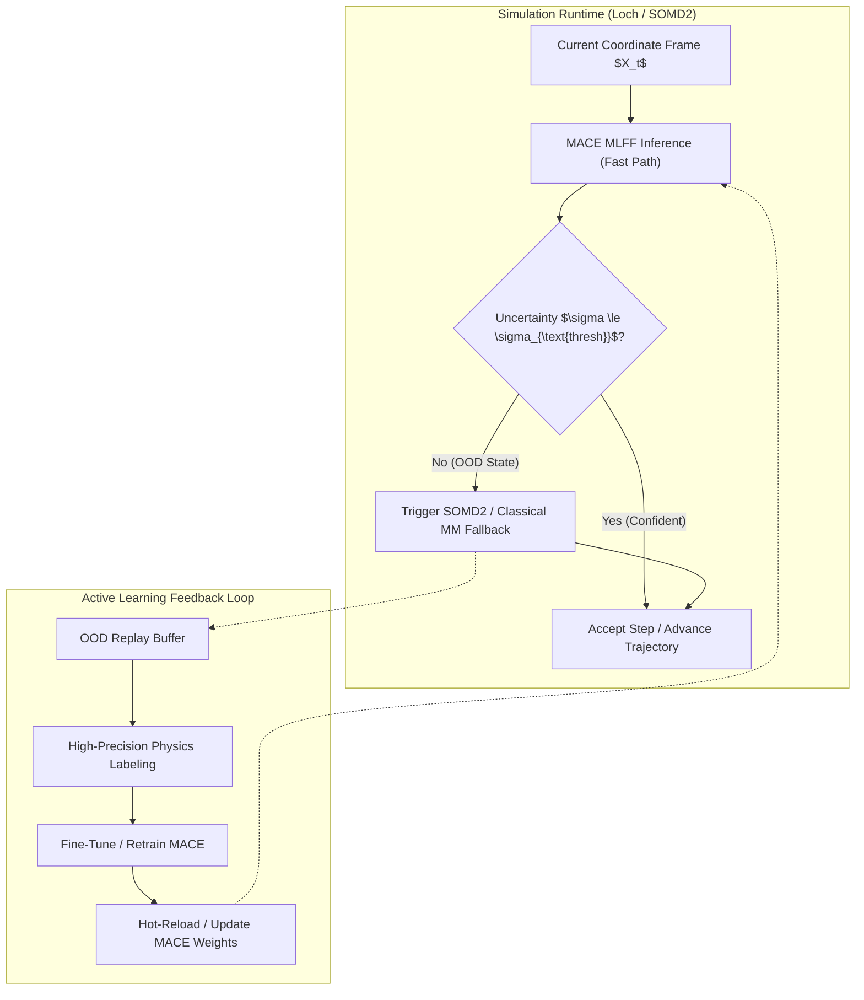

# Engineering Brief: GNN-Driven Active Learning for FEP/GCMC Pipeline

**Project:** `csbrt-gcmc-fep`  
**Target Goal:** Refactor the drug discovery pipeline to reduce overall simulation time by roughly 50% via a hybrid Machine Learning Force Field (MLFF / MACE) surrogate, with active learning runtime uncertainty monitoring and seamless fallback to the SOMD2 physics engine.

---

## 1. Executive Summary & Objective

The `csbrt-gcmc-fep` repository automates hydration-aware relative binding free energy (RBFE) calculations through a staged workflow:
$$\text{OpenFold3 (Loop Modeling)} \longrightarrow \text{Loch GCMC (Hydration Sampling)} \longrightarrow \text{SOMD2 (Alchemical FEP)} \longrightarrow \text{Analysis}$$

### The Computational Bottleneck
In the current production workflow, both **Loch GCMC** (Grand-Canonical Monte Carlo water insertion/deletion and local relaxation) and **SOMD2** (Hamiltonian Replica Exchange FEP across $11+$ alchemical $\lambda$ windows) evaluate classical molecular mechanics (MM) potential energies and forces at every integration timestep and Monte Carlo proposal. In high-dimensional solvated protein-ligand complexes ($30{,}000 - 60{,}000+$ atoms), these rigorous physics evaluations represent $>90\%$ of total campaign wall-clock time.

### The ML Surrogate Solution
By deploying **MACE** (Multi-Atomic Cluster Expansion)—a higher-order $E(3)$-equivariant Graph Neural Network—as a surrogate potential within a hybrid ML/MM framework (via OpenMM-ML), we can accelerate energy/force predictions while maintaining quantum-mechanical accuracy for critical binding interactions. 

Crucially, ML potentials can fail catastrophically when exploring out-of-distribution (OOD) conformational states or novel chemical environments. To guarantee absolute thermodynamic fidelity, this architecture incorporates an **Active Learning Fallback Loop**:
1. **Fast Path:** Run dynamics and energy evaluations with MACE via OpenMM-ML.
2. **Uncertainty Monitoring:** Compute prediction variance/uncertainty in real-time.
3. **Physics Fallback:** Automatically halt MACE and divert to SOMD2/Sire physics when uncertainty exceeds a calibrated threshold ($\sigma_{\text{threshold}}$).
4. **Data Feedback Loop:** Harvest out-of-distribution frames, generate ground-truth energies/forces via the physics engine, and fine-tune the MACE model to continuously contract the fallback frequency.



---

## 2. Core Architecture & Phase Breakdown

| Phase | Designation | Functional Description | Key Technical Requirements |
| :--- | :--- | :--- | :--- |
| **1** | **Fast Path Engine** | Drive MD and energy evaluations using MACE surrogate within a hybrid ML/MM partition. | • OpenMM-ML integration (`openmmml.MLPotential('mace')`).<br>• Partitioning via `createMixedSystem()`: Ligand (+ optional binding site waters) in ML region; receptor and bulk solvent in classical MM (ff14SB / TIP3P).<br>• Pre-trained foundation models (`mace-off23-small/medium`, `mace-omol-0`). |
| **2** | **Uncertainty Monitoring** | Quantify prediction confidence per-frame during simulation runtime. | • Ensemble committee variance: $\sigma_F = \max_i \text{std}(\mathbf{F}_i)$ or energy variance $\sigma_E$.<br>• Latent space distance metric or committee force threshold ($\sim 0.05\text{ eV/\AA}$).<br>• Zero-copy GPU memory extraction during OpenMM integration. |
| **3** | **Physics Fallback** | Intercept high-uncertainty frames and switch potential evaluator to SOMD2 / classical MM. | • Dynamic context switching in OpenMM/Sire.<br>• Dual-Hamiltonian or conditional force evaluation.<br>• Trajectory continuity and momentum conservation across transitions. |
| **4** | **Data Feedback Loop** | Retrain/fine-tune MACE on flagged edge cases. | • Frame deduplication and clustering in OOD buffer.<br>• Ground truth energy/force calculation via SOMD2/AmberTools (or DFT reference).<br>• Automated fine-tuning script preserving foundation model stability. |

---

## 3. Literature Grounding & Theoretical Basis

The architectural design is grounded in the foundational literature ingested in `docs/`:

1. **Duignan (2024)** — *The Potential of Neural Network Potentials* (ACS Phys. Chem. Au 2024, 4, 232–241, `docs/duignan2024_potential_nnps.pdf`):
   - Establishes the theoretical validity of higher-order equivariant Graph Neural Networks (such as MACE) for molecular potential energy surfaces.
   - Formalizes the active learning loop where uncertainty-driven dynamics flag undersampled regions, preventing non-physical artifacts.
   - Highlights that while equivariant NNPs are computationally heavier than empirical point-charge force fields, their deployment in focused active regions yields high-throughput quantum fidelity.

2. **Wang, Eastman, Tuckerman et al. (2024)** — *On the Design Space Between Molecular Mechanics and Machine Learning Force Fields* (arXiv:2409.02861, `docs/wang2024_design_space_mm_mlff.pdf`):
   - Analyzes computational trade-offs: Classical MM ($100-1000\text{ ns/day}$), Hybrid ML/MM ($10-50\text{ ns/day}$), Pure MLFF ($0.1-1\text{ ns/day}$ on macro-complexes).
   - Demonstrates the efficacy of OpenMM-ML's `createMixedSystem()` for mechanical and electrostatic embedding, treating the ligand (40–80 atoms) with ML and the bulk environment with classical force fields.
   - Demonstrates that hybrid alchemical free energy calculations (RBFE) achieve chemical accuracy ($< 1\text{ kcal/mol}$) when the perturbable region is handled by a neural potential while retaining MM efficiency for long-range interactions.

---

## 4. Technical Environment & Version Matrix

Answering the dependency specification question:

| Component | Target Version | Rationale & Constraint |
| :--- | :--- | :--- |
| **Python** | `3.12` | Aligned with existing `csbrt` conda environment. |
| **SOMD2** | `2026.1.0` | OpenBioSim RBFE engine; installed via `openbiosim` channel. |
| **Sire** | `2026.1.0` | Underlying molecular framework shared by Loch and SOMD2. |
| **Loch** | `2026.1.0` | GCMC sampling engine for water titration. |
| **OpenMM** | `8.4.0` | MD simulation engine with CUDA platform support. |
| **CUDA Toolchain**| `12.8` (pinned whole) | Prevents `CUDA_ERROR_UNSUPPORTED_PTX_VERSION (222)` on cluster drivers. |
| **PyTorch** | `2.7.1` (cu126 wheels) | Supports OpenFold3 and MACE-Torch inference without conflicting with conda nvcc. |
| **OpenMM-ML** | Latest stable | High-level API for mixed MM/ML systems (`createMixedSystem`). |
| **MACE-Torch** | `>= 0.3.10` | Provides `mace-off23` / `mace-omol` models and committee uncertainty metrics. |

---

## 5. Implementation Roadmap & Parallelisation

The implementation is structured into 6 sequential stages, with parallel execution streams:

```
[Track A: Surrogate & ML/MM]    Stage 0 (Deps) ──> Stage 1 (OpenMM-ML & MACE) ──┐
                                                                                 ├──> Stage 3 (Fallback Engine) ──> Stage 5 (Pipeline) ──> Stage 6 (Validation)
[Track B: UQ & Active Learning] Stage 0 (Deps) ──> Stage 2 (Uncertainty Monitor) ──┴──> Stage 4 (Active Buffer) ┘
```

1. **Stage 0: Environment & Dependency Manifest** (Sequential)
   - Update `csbrt/environment.yml` and `install.sh` to include `openmm-ml`, `mace-torch`, and PyTorch C++ bindings while honoring CUDA 12.8 pins.
2. **Stage 1: Hybrid ML/MM Potential Integration (Fast Path)** (*Parallel with Stage 2*)
   - Implement `mace_potential.py` wrapper using `openmmml.MLPotential('mace')`.
   - Implement `createMixedSystem()` for SOMD2 and Loch endpoints.
3. **Stage 2: Real-Time Uncertainty Quantification Monitor** (*Parallel with Stage 1*)
   - Implement ensemble force standard deviation $\sigma_F$ and energy variance $\sigma_E$ extractors.
   - Establish baseline confidence thresholds on known ligand sets.
4. **Stage 3: Physics Fallback & Context Handoff Engine** (Sequential after 1 & 2)
   - Implement interceptor in Loch/SOMD2 dynamics loop.
   - Ensure seamless transition to SOMD2 classical Hamiltonian upon trigger without loss of integration state.
5. **Stage 4: Active Learning Data Buffer & Fine-Tuning** (*Parallel with Stage 3*)
   - Implement OOD frame capture, deduplication, and automated reference labeling.
   - Build automated MACE fine-tuning routine.
6. **Stage 5: csbrt Pipeline & HPC Integration** (Sequential after 3 & 4)
   - Expose `--enable-mace-surrogate` and config parameters in `run.yaml` and `csbrt/src/csbrt/cli.py`.
   - Update Slurm submitters (`submit_fep_edges.sh`).
7. **Stage 6: Benchmarking & Verification Suite** (Final)
   - Energy conservation tests ($NVE$).
   - $\Delta\Delta G$ validation against crystal benchmark series (Rowan comparison parity).
   - Throughput assessment verifying the $\sim 50\%$ simulation time reduction target.

