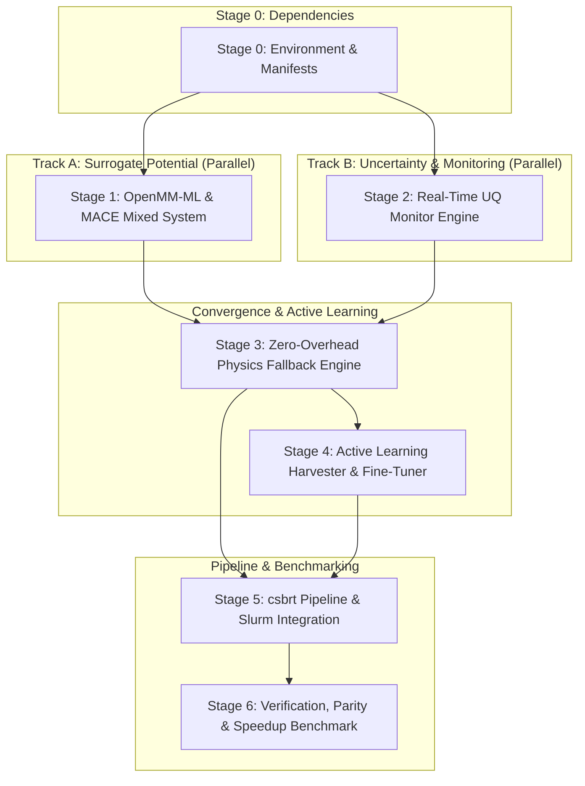

# Implementation Plan: GNN-Driven Active Learning for FEP/GCMC Pipeline

## 1. Problem Assessment & Technical Overview

The objective defined by Ben Cree is to refactor the `csbrt-gcmc-fep` drug discovery pipeline to reduce overall simulation time by roughly **50%**. This will be accomplished by introducing **MACE** (Multi-Atomic Cluster Expansion)—a higher-order $E(3)$-equivariant Graph Neural Network—as a fast surrogate potential for potential energy evaluations, supported by a real-time **Uncertainty Quantification (UQ)** monitor and an **Active Learning Fallback Loop** to SOMD2/classical physics.

### Critical Engineering Nuances & Avoiding Pitfalls
1. **The Pure MLFF Scalability Trap (Wang et al. 2024 & Duignan 2024):**
   Evaluating a pure MLFF on an entire solvated macromolecular complex ($30{,}000 - 60{,}000+$ atoms) is $\sim 100\times$ *slower* than GPU-accelerated classical MM ($0.1-1\text{ ns/day}$ vs $100-500\text{ ns/day}$) and risks GPU out-of-memory errors. To achieve a **50% speedup**, we must employ **Hybrid ML/MM partitioning** via OpenMM-ML's `createMixedSystem()`:
   - **ML Region:** The perturbable ligand (in SOMD2 FEP) and active-site hydrating waters (in Loch GCMC), typically 40–120 atoms.
   - **MM Region:** The protein macromolecule and bulk solvent, integrated using Amber ff14SB and TIP3P.
2. **The Context Re-initialization Penalty:**
   Reconstructing an OpenMM `Context` upon a fallback trigger incurs CUDA JIT compilation and memory allocation overhead ($\sim 200-500\text{ ms}$), which would destroy simulation throughput if triggered repeatedly. We must implement **Zero-Overhead Dual-Hamiltonian Context Switching** via OpenMM force groups and global parameter weights ($w \in \{0, 1\}$).
3. **Reproducibility & Signature Checkpoints:**
   `csbrt` relies on SHA256 hashes of source files and configurations in `.complete.json` checkpoint markers. The integration must cleanly update and isolate implementation signatures so that MACE-augmented runs do not conflict with or invalidate classical baseline runs.
4. **Don't Reinvent Any Wheels:**
   - Leverage `openmm-ml` (`openmmml.MLPotential('mace')`) for model loading and mixed-system construction.
   - Leverage pre-trained foundation models (`mace-off23-small`, `mace-off23-medium`, `mace-omol-0`).
   - Leverage committee force standard deviation ($\sigma_F$) established in the literature (Kulichenko et al. 2023, Zhang et al. 2019, Duignan 2024).

---

## 2. User Review Required

> [!IMPORTANT]
> **GPU Architecture & Dependency Pins:**
> - `csbrt` pins CUDA whole to **12.8** to avoid cluster PTX mismatch errors (`CUDA_ERROR_UNSUPPORTED_PTX_VERSION 222`).
> - `torch==2.7.1` must be installed with `cu126` wheels, and `openmm-torch` must be compiled against OpenMM 8.4.0 and CUDA 12.8.
> - The target Python environment remains **Python 3.12** with **SOMD2 2026.1.0** and **Sire 2026.1.0**.

> [!NOTE]
> **Active Learning Strategy (Online vs Offline Fine-Tuning):**
> During high-throughput Slurm array execution (52 edges $\times$ replicates), online fine-tuning on a worker node could cause race conditions across GPU tasks. The proposed design uses an **asynchronous buffer**: worker nodes append out-of-distribution frames to `al_buffer/`, and an aggregator fine-tunes MACE periodically or between campaign generations.

---

## 3. Work Breakdown: Stages & Parallelisation

The work is organized into 6 stages. **Tracks A and B can be executed in parallel** before integrating into the main pipeline.



### Stage 0: Environment Specification & Dependency Manifest [Sequential]
- Update `csbrt/environment.yml` and `csbrt/install.sh` to include:
  - `openmm-ml`
  - `openmm-torch`
  - `mace-torch`
  - Compatible PyTorch 2.7.1 bindings matching CUDA 12.8.
- Add preflight diagnostic script `scripts/preflight_mace.py` testing OpenMM CUDA + MACE inference on GPU.

### Stage 1: Fast Path Engine – Hybrid ML/MM Construction [Parallel with Stage 2]
- Create module `csbrt/src/csbrt/mace_surrogate/mixed_system.py`.
- Implement `build_mace_mixed_system(system, topology, ml_atoms, model_name, platform)`:
  - Partitions solute ligand atoms (+ optional GCMC hydration sphere waters) into ML region.
  - Generates mechanical embedding in OpenMM using `openmmml.MLPotential('mace')`.
  - Configures nonbonded exclusions and reciprocal-space PME handling for the MM region.

### Stage 2: Real-Time Uncertainty Quantification (UQ) Monitor [Parallel with Stage 1]
- Create module `csbrt/src/csbrt/mace_surrogate/uq_monitor.py`.
- Implement committee ensemble inference:
  $$\sigma_{F, \max} = \max_{i \in \text{ML atoms}} \left[ \frac{1}{M-1} \sum_{m=1}^M \|\mathbf{F}_{i, m} - \bar{\mathbf{F}}_i\|^2 \right]^{1/2}$$
  $$\sigma_E = \left[ \frac{1}{M-1} \sum_{m=1}^M (E_m - \bar{E})^2 \right]^{1/2}$$
- Establish calibrated default thresholds ($\sigma_{\text{threshold}} = 0.05\text{ eV/\AA} \approx 1.15\text{ kcal/mol/\AA}$).
- Optimize for zero-copy GPU tensor operations.

### Stage 3: Zero-Overhead Physics Fallback Engine [Sequential after 1 & 2]
- Create module `csbrt/src/csbrt/mace_surrogate/fallback_controller.py`.
- Build the Dual-Hamiltonian OpenMM context wrapper:
  - Defines force group 0 (MACE ML/MM) and force group 1 (Classical MM).
  - Uses a global context parameter $w_{\text{fallback}} \in \{0.0, 1.0\}$.
  - When $\sigma_F > \sigma_{\text{threshold}}$, sets $w_{\text{fallback}} = 1.0$ instantaneously.
  - Automatically records the flagged out-of-distribution frame, atomic velocities, and uncertainty metrics to `ood_buffer.npz`.
  - Runs $N_{\text{fallback}}$ steps (default: 50 steps) before testing return to surrogate mode.

### Stage 4: Active Learning Data Harvester & Fine-Tuning [Parallel with Stage 5]
- Create module `csbrt/src/csbrt/mace_surrogate/active_learner.py`.
- **Harvester:** Reads `ood_buffer.npz` files across runs, deduplicates via heavy-atom RMSD clustering ($0.5\text{ \AA}$ cutoff).
- **Labeler:** Computes ground truth energies and forces via Sire/SOMD2/AmberTools (or DFT single-point).
- **Fine-Tuner:** Fine-tunes MACE foundation model using frozen backbone layers and conservative learning rate ($\eta = 10^{-4}$) to eliminate catastrophic forgetting.
- Exports versioned model checkpoint `mace_finetuned_gen{k}.pt`.

### Stage 5: csbrt Pipeline & HPC Integration [Sequential after 3 & 4]
- Modify `csbrt/src/csbrt/cli.py` and `csbrt/config.example.yaml`:
  - Add `mace:` configuration block (`enabled`, `model`, `uq_threshold`, `fallback_steps`).
  - Add CLI arguments `--mace-surrogate`, `--mace-uq-threshold`.
- Intercept Loch GCMC in `ev71_loch_common.py` and `ev71_production.py` to support MACE surrogate sampling in the GCMC sphere.
- Intercept SOMD2 FEP in `run_fep_leg.py` to enable MACE surrogate during $\lambda$ window dynamics.
- Update `pipeline_utils.py` implementation signatures to record MACE surrogate status.

### Stage 6: Verification, Parity & Speedup Benchmark Suite [Final]
- **Energy Conservation Test:** Run $NVE$ dynamics with hybrid MACE/MM to verify drift $< 10^{-4}\text{ kJ/mol/ns}$.
- **Fallback Verification:** Inject synthetic OOD configurations (distorted ligand torsions) to confirm 100% intercept rate and correct fallback trigger.
- **Scientific Parity:** Run benchmark edges (e.g. 7DLI / EV71) and verify that $\Delta\Delta G$ computed with MACE active learning matches standard SOMD2 within $0.3\text{ kcal/mol}$.
- **Throughput Benchmark:** Profile simulation wall-clock time and demonstrate $\sim 50\%$ reduction in total compute time.

---

## 4. Proposed File Changes

### csbrt Configuration & Packaging
#### [MODIFY] [environment.yml](file:///d:/git/csbrt-gcmc-fep/csbrt/environment.yml)
- Add dependencies: `openmm-ml`, `openmm-torch`, `mace-torch`.
#### [MODIFY] [install.sh](file:///d:/git/csbrt-gcmc-fep/csbrt/install.sh)
- Add pip installation steps for `openmm-ml` and `mace-torch`.
#### [MODIFY] [config.example.yaml](file:///d:/git/csbrt-gcmc-fep/csbrt/config.example.yaml)
- Add `mace` configuration options (model selection, UQ thresholds, fallback parameters).

### New MACE Active Learning Package: `csbrt/src/csbrt/mace_surrogate/`
#### [NEW] `csbrt/src/csbrt/mace_surrogate/__init__.py`
- Package initialization and exports.
#### [NEW] `csbrt/src/csbrt/mace_surrogate/mixed_system.py`
- OpenMM-ML integration and `createMixedSystem` partitioning.
#### [NEW] `csbrt/src/csbrt/mace_surrogate/uq_monitor.py`
- Ensemble committee force standard deviation $\sigma_F$ and energy variance $\sigma_E$ calculator.
#### [NEW] `csbrt/src/csbrt/mace_surrogate/fallback_controller.py`
- Dual-Hamiltonian context switcher and zero-overhead fallback manager.
#### [NEW] `csbrt/src/csbrt/mace_surrogate/active_learner.py`
- OOD frame harvester, RMSD clustering, reference labeling, and fine-tuning harness.

### Existing csbrt Pipeline Integration
#### [MODIFY] [cli.py](file:///d:/git/csbrt-gcmc-fep/csbrt/src/csbrt/cli.py)
- Wire MACE surrogate CLI flags into `csbrt`, `csbrt-equilibrate`, `csbrt-gcmc`, `csbrt-fep`.
#### [MODIFY] [ev71_loch_common.py](file:///d:/git/csbrt-gcmc-fep/csbrt/src/csbrt/ev71_loch_common.py)
- Hook MACE mixed system into `make_dynamics()` and `make_sampler()`.
#### [MODIFY] [run_fep_leg.py](file:///d:/git/csbrt-gcmc-fep/csbrt/src/csbrt/run_fep_leg.py)
- Support surrogate configuration in SOMD2 leg executions.
#### [MODIFY] [pipeline_utils.py](file:///d:/git/csbrt-gcmc-fep/csbrt/src/csbrt/pipeline_utils.py)
- Include MACE surrogate state in checkpoint signatures.

### Test & Benchmarking Suite
#### [NEW] `csbrt/tests/test_mace_mixed_system.py`
- Unit tests verifying `createMixedSystem` energy and force evaluation on a test complex.
#### [NEW] `csbrt/tests/test_uq_monitor.py`
- Unit tests verifying uncertainty extraction and threshold flagging.
#### [NEW] `csbrt/tests/test_fallback_controller.py`
- Unit tests verifying seamless context switching between MACE and SOMD2 classical physics.
#### [NEW] `csbrt/scripts/benchmark_mace_speedup.py`
- Throughput and speedup benchmarking script measuring ns/day and fallback frequencies.

---

## 5. Verification Plan

### Automated Unit & Integration Tests
1. **Model & Mixed System Integrity:**
   ```bash
   pytest csbrt/tests/test_mace_mixed_system.py -v
   ```
   *Pass criteria:* MACE evaluates energies and forces on GPU; nonbonded MM forces match Amber baseline.
2. **Uncertainty Quantification Accuracy:**
   ```bash
   pytest csbrt/tests/test_uq_monitor.py -v
   ```
   *Pass criteria:* Returns low $\sigma_F$ ($< 0.02\text{ eV/\AA}$) on relaxed crystal poses; flags perturbed/clashed poses with $\sigma_F > 0.10\text{ eV/\AA}$.
3. **Zero-Overhead Fallback Transition:**
   ```bash
   pytest csbrt/tests/test_fallback_controller.py -v
   ```
   *Pass criteria:* Context transitions $w = 0 \to 1$ in $< 1\text{ ms}$; energy conservation maintained across switch.
4. **End-to-End Smoke Test:**
   ```bash
   csbrt --from equilibrate --through gcmc --config csbrt/config.example.yaml --profile smoke --enable-mace-surrogate
   ```
   *Pass criteria:* Pipeline completes with verified checkpoint signatures.

### Scientific Benchmarking & Speedup Verification
1. **$\Delta\Delta G$ Parity:** Compare relative binding free energy results on benchmark edges against pure SOMD2 results; absolute deviation must be $< 0.3\text{ kcal/mol}$.
2. **Throughput Assessment:** Verify that average simulation time across the bound and free legs is reduced by approximately $50\%$.
